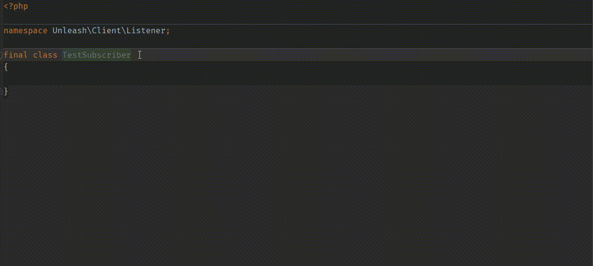

# Event system in Unleash PHP SDK

This SDK supports events using [`symfony/event-dispatcher`](https://packagist.org/packages/symfony/event-dispatcher).

## Installation

The event dispatcher is not a mandatory component of this SDK, so you need to install it by running:

`composer require symfony/event-dispatcher`

## Usage

You can add event subscribers to the builder object:

```php
<?php

use Symfony\Component\EventDispatcher\EventSubscriberInterface;
use Unleash\Client\Event\FeatureToggleDisabledEvent;
use Unleash\Client\Event\FeatureToggleMissingStrategyHandlerEvent;
use Unleash\Client\Event\FeatureToggleNotFoundEvent;
use Unleash\Client\Event\FeatureVariantBeforeFallbackReturnedEvent;
use Unleash\Client\UnleashBuilder;
use Unleash\Client\Event\UnleashEvents;

class MyEventSubscriber implements EventSubscriberInterface
{
    public static function getSubscribedEvents(): array
    {
        return [
            UnleashEvents::FEATURE_TOGGLE_DISABLED => 'onFeatureDisabled',
            UnleashEvents::FEATURE_TOGGLE_MISSING_STRATEGY_HANDLER => 'onNoStrategyHandler',
            UnleashEvents::FEATURE_TOGGLE_NOT_FOUND => 'onFeatureNotFound',
        ];
    }
    
    public function onFeatureDisabled(FeatureToggleDisabledEvent $event)
    {
        // todo
    }
    
    public function onNoStrategyHandler(FeatureToggleMissingStrategyHandlerEvent $event)
    {
        // todo
    }
    
    public function onFeatureNotFound(FeatureToggleNotFoundEvent $event)
    {
        // todo
    }
}

$unleash = UnleashBuilder::create()
    ->withAppName('My App')
    ->withAppUrl('http://localhost:4242')
    ->withInstanceId('test')
    ->withEventSubscriber(new MyEventSubscriber())
    ->build();

$unleash->isEnabled('test');
```

The relevant methods will be called in the above example when their respective event occurs.

### List of events:

- `\Unleash\Client\Event\UnleashEvents::FEATURE_TOGGLE_NOT_FOUND` - when a feature with the name isn't found on the
  unleash server (or in the bootstrap if it's used). Event object: `Unleash\Client\Event\FeatureToggleNotFoundEvent`
- `\Unleash\Client\Event\UnleashEvents::FEATURE_TOGGLE_DISABLED` - when a feature is found but it's disabled.
  Event object: Unleash\Client\Event\FeatureToggleDisabledEvent
- `\Unleash\Client\Event\UnleashEvents::FEATURE_TOGGLE_MISSING_STRATEGY_HANDLER` - when there is no suitable strategy handler
  implemented for any of the feature's strategies. Event object: `Unleash\Client\Event\FeatureToggleMissingStrategyHandlerEvent`

## FEATURE_TOGGLE_NOT_FOUND event

Example:

```php
<?php

use Symfony\Component\EventDispatcher\EventSubscriberInterface;
use Unleash\Client\Event\FeatureToggleNotFoundEvent;
use Unleash\Client\Event\UnleashEvents;
use Unleash\Client\DTO\DefaultFeature;
use Unleash\Client\UnleashBuilder;

final class MyEventSubscriber implements EventSubscriberInterface
{
    public static function getSubscribedEvents()
    {
        return [
            UnleashEvents::FEATURE_TOGGLE_NOT_FOUND => 'onNotFound',
        ];
    }
    
    public function onNotFound(FeatureToggleNotFoundEvent $event): void
    {
        // methods:
        $event->getFeatureName(); // string
        $event->getContext(); // instance of Context
    }
}

$unleash = UnleashBuilder::create()
    ->withEventSubscriber(new MyEventSubscriber())
    ->build();
```

## FEATURE_TOGGLE_DISABLED event

Example:

```php
<?php

use Symfony\Component\EventDispatcher\EventSubscriberInterface;
use Unleash\Client\Event\FeatureToggleDisabledEvent;
use Unleash\Client\Event\UnleashEvents;
use Unleash\Client\DTO\DefaultFeature;
use Unleash\Client\DTO\DefaultStrategy;

final class MyEventSubscriber implements EventSubscriberInterface
{
    public static function getSubscribedEvents()
    {
        return [
            UnleashEvents::FEATURE_TOGGLE_DISABLED => 'onFeatureDisabled',
        ];
    }
    
    public function onFeatureDisabled(FeatureToggleDisabledEvent $event): void
    {
        // methods:
        $event->getContext(); // instance of Context
        $event->getFeature(); // instance of Feature
    }
}
```

## FEATURE_TOGGLE_MISSING_STRATEGY_HANDLER event

Triggered when no strategy handler can be found for any of the strategies.

Example:

```php
<?php

use Symfony\Component\EventDispatcher\EventSubscriberInterface;
use Unleash\Client\Event\UnleashEvents;
use Unleash\Client\UnleashBuilder;
use Unleash\Client\Event\FeatureToggleMissingStrategyHandlerEvent;
use Unleash\Client\Strategy\DefaultStrategyHandler;

final class MyEventSubscriber implements EventSubscriberInterface
{
    public static function getSubscribedEvents()
    {
        return [
            UnleashEvents::FEATURE_TOGGLE_MISSING_STRATEGY_HANDLER => 'onMissingStrategyHandler',
        ];
    }
    
    public function onMissingStrategyHandler(FeatureToggleMissingStrategyHandlerEvent $event): void
    {
        // methods:
        $event->getContext(); // instance of Context
        $event->getFeature(); // instance of Feature
        // get strategies
        $event->getFeature()->getStrategies(); // iterable of Strategy instances
    }
}
```

## Customizing event dispatcher

If you already use event dispatcher in your app, you can provide it to the builder:

```php
<?php

use Symfony\Component\EventDispatcher\EventDispatcher;
use Unleash\Client\UnleashBuilder;

$eventDispatcher = new EventDispatcher();

// do something with event dispatcher

$unleash = UnleashBuilder::create()
    ->withEventDispatcher($eventDispatcher)
    // add other unleash configurations
    ->build();
```

All event subscribers/listeners registered directly in the event dispatcher work as usual:

```php
<?php

use Symfony\Component\EventDispatcher\EventDispatcher;
use Unleash\Client\UnleashBuilder;
use Unleash\Client\Event\UnleashEvents;
use Unleash\Client\Event\FeatureToggleDisabledEvent;

$eventDispatcher = new EventDispatcher();

$eventDispatcher->addSubscriber(new MyEventSubscriber());
$eventDispatcher->addListener(UnleashEvents::FEATURE_TOGGLE_DISABLED, function (FeatureToggleDisabledEvent $event) {
    // todo
});


$unleash = UnleashBuilder::create()
    ->withEventDispatcher($eventDispatcher)
    // add other unleash configurations
    ->build();
```

> Tip for PhpStorm users: Use the [Symfony plugin](https://plugins.jetbrains.com/plugin/7219-symfony-support)
> for help with autocompletion of events, afterwards it looks like this:



